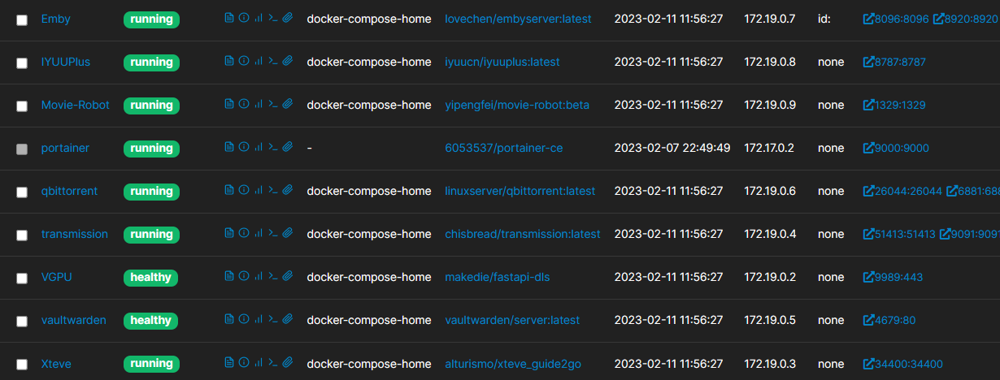

<!--
 * @Description: 
 * @Version: 
 * @Author: BaiYiZhuo
 * @Date: 2023-02-11 12:02:40
 * @LastEditTime: 2023-02-11 12:17:58
-->
# home-server
家庭服务docker-compose配置，修改Compose文件中的路径即可
- `/home/byz/docker`: docker映射卷目录
- `/mnt/nfs/`: 挂载的媒体目录
**一键安装**
- Emby
- Bitvault
- Qbittorent
- IyuuPlus
- Xteve
- VGPU
- Transmission
- Movie-Robot

